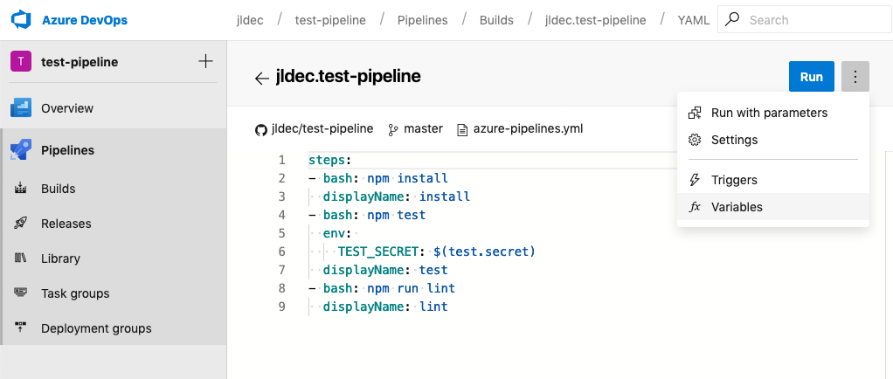
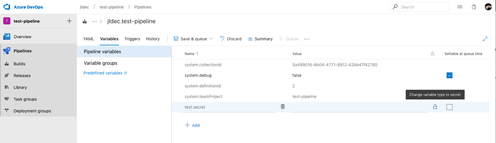

## test-pipeline
[](https://dev.azure.com/jldec/test-pipeline/_build/latest?definitionId=2&branchName=master)

Simple js module for testing secrets in CI. Used in this [Azure test-pipeline](https://dev.azure.com/jldec/test-pipeline).

Checks for environment variable TEST_SECRET to have the value 'booger'

### How to edit Azure Pipeline variables
Click on edit, then click on the `⋮` on the right, then click on Variables. 


### How to make secret variable
Click on the padlock next to the value.


```sh
$ TEST_SECRET=booger npm test

> test-pipeline@0.0.1 test /Users/jleschner/azure/test-pipeline
> tape test/*.js

TAP version 13
# test-test-pipeline
x 3
TEST_SECRET booger
ok 1 should be equivalent

1..1
# tests 1
# pass  1

# ok
```

```sh
$ TEST_SECRET=wooger npm test

> test-pipeline@0.0.1 test /Users/jleschner/azure/test-pipeline
> tape test/*.js

TAP version 13
# test-test-pipeline
x 3
TEST_SECRET wooger
not ok 1 should be equivalent
  ---
    operator: deepEqual
    expected: [ 3, 'booger' ]
    actual:   [ 3, 'wooger' ]
    at: Test.<anonymous> (/Users/jleschner/azure/test-pipeline/test/test-test-pipeline.js:12:5)
    stack: |-
      Error: should be equivalent
          at Test.assert [as _assert] (/Users/jleschner/azure/test-pipeline/node_modules/tape/lib/test.js:226:54)
          at Test.bound [as _assert] (/Users/jleschner/azure/test-pipeline/node_modules/tape/lib/test.js:77:32)
          at Test.tapeDeepEqual (/Users/jleschner/azure/test-pipeline/node_modules/tape/lib/test.js:423:10)
          at Test.bound [as deepEqual] (/Users/jleschner/azure/test-pipeline/node_modules/tape/lib/test.js:77:32)
          at Test.<anonymous> (/Users/jleschner/azure/test-pipeline/test/test-test-pipeline.js:12:5)
          at Test.bound [as _cb] (/Users/jleschner/azure/test-pipeline/node_modules/tape/lib/test.js:77:32)
          at Test.run (/Users/jleschner/azure/test-pipeline/node_modules/tape/lib/test.js:96:10)
          at Test.bound [as run] (/Users/jleschner/azure/test-pipeline/node_modules/tape/lib/test.js:77:32)
          at Immediate.next [as _onImmediate] (/Users/jleschner/azure/test-pipeline/node_modules/tape/lib/results.js:75:19)
          at processImmediate (timers.js:632:19)
  ...

1..1
# tests 1
# pass  0
# fail  1

npm ERR! Test failed.  See above for more details.
``` 
